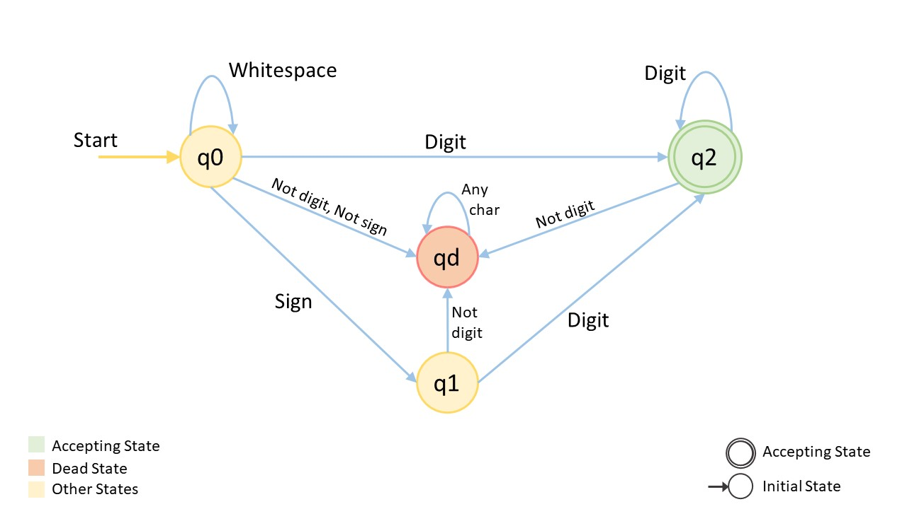

# [Deterministic Finite Automaton (DFA)](https://en.wikipedia.org/wiki/Deterministic_finite_automaton) <!-- omit from toc -->

- [A Short Introduction to DFA](#a-short-introduction-to-dfa)
- [LeetCode Problems Which Can Be Solved Using DFA](#leetcode-problems-which-can-be-solved-using-dfa)
- [String to Integer ATOI](#string-to-integer-atoi)

In the theory of computation, a branch of theoretical computer science, a **deterministic finite automaton** (DFA) is a **finite-state machine** that accepts or rejects a given string of symbols, by running through a state sequence uniquely determined by the string. *Deterministic* refers to the uniqueness of the computation run.

## A Short Introduction to DFA

**Theory of Computing** is the study of theoretical machines and problems which can be solved using these machines. These machines are called **state machines**. A state machine reads some input and changes the states based on those inputs. The state machines with a finite number of states are called **finite state machines**.

- One such example that we are all familiar with is a traffic light. The most common type of traffic light has 3 lights: red, green, and yellow. At any time, only one of the lights is on and the traffic light will cycle from red (wait for some time), then to green (wait for some time), then to yellow (for a short time), and finally, turn back to red.
  - Each color can be referred to as a state and the change in color is called a transition.
  - How does the state machine know to transition? Each transition will be the result of some input and depending on the input we will either stay in the same state or transition to a different state. In this example, it will be after some amount of time has passed we will transition to a new color and if less than that amount of time has passed, we will remain at the same color.
  
- Browsing a website can also be treated as a finite state machine. Think of each webpage as a state and transitions occurring due to certain clicks/events.
- So can a turnstile. For practice, you can try drawing [a state diagram for a turnstile](https://en.wikipedia.org/wiki/Finite-state_machine) that is initially locked, becomes unlocked when a coin is inserted and becomes locked again after being pushed.

One possible application for finite state machines is to generate languages.
A language is a set of strings made up of characters from a specified set of symbols/alphabets.

We can traverse through the states in a state machine diagram to see what kinds of strings the machine will produce, or we can input a string and verify whether or not there exists a set of transitions that could be used to make the string.

- For example, if we have symbols R, G, Y which represent red, green, and yellow respectively, then our traffic light state machine can generate a string like, "GYRG", and will reject "GYRY" because, we cannot transition from a red light to a yellow light.

The finite state machine that either accepts or rejects a sequence of characters by running through a sequence of states is called DFA.

There is only one path for specific input from the current state to the next state in DFA. DFAs are useful to recognize patterns in data.

## LeetCode Problems Which Can Be Solved Using DFA

- [String to Integer ATOI](https://leetcode.com/problems/string-to-integer-atoi)
- [Valid Number](https://leetcode.com/problems/valid-number/)
- [Regular Expression Matching](https://leetcode.com/problems/regular-expression-matching/)
- [Detect Capital](https://leetcode.com/problems/detect-capital/)
- [Find and Replace Pattern](https://leetcode.com/problems/find-and-replace-pattern/)
- [Binary Prefix Divisible By 5](https://leetcode.com/problems/binary-prefix-divisible-by-5/)
- [Wildcard Matching](https://leetcode.com/problems/wildcard-matching/)

## [String to Integer ATOI](https://leetcode.com/problems/string-to-integer-atoi)

State diagram

Solution

- [Python](/algorithms/python/medium/8.StringToIntegerAtoi.py)
